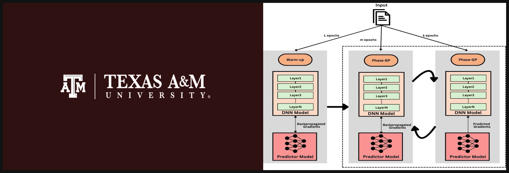

# **Implementing Adaptive Gradient Prediction (ADAGP)**

<p align="center">
  
</p>

---

### **Description**
This repository contains the implementation of the paper ADA-GP: Accelerating DNN Training By Adaptive Gradient Prediction done as a group project for CSCE-614, taught by Prof. EJ Kim. The code is written in python leveraging the open source deep learning library *PyTorch*. Authors of the code are Eshaan Mandal, Keshav Kishore, Rebecca Robin and Neha Daoo from Group-12.

### About  **ADA-GP** 
[Authors: Vahid Janfaza, Shantanu Manda, Farabi Mahmud, Abdullah Muzahid]  
[Conference: MICRO 2023]  
[Link to the paper : [ADA-GP MICRO 2023](https://people.tamu.edu/~abdullah.muzahid/files/adagp.pdf))]

**Abstract:**  
*Neural network training is inherently sequential where the layers
finish the forward propagation in succession, followed by the calcu-
lation and back-propagation of gradients (based on a loss function)
starting from the last layer. The sequential computations signifi-
cantly slow down neural network training, especially the deeper
ones. Prediction has been successfully used in many areas of com-
puter architecture to speed up sequential processing. Therefore,
we propose ADA-GP, which uses gradient prediction adaptively to
speed up deep neural network (DNN) training while maintaining
accuracy. ADA-GP works by incorporating a small neural network
to predict gradients for different layers of a DNN model. ADA-GP
uses a novel tensor reorganization method to make it feasible to
predict a large number of gradients. ADA-GP alternates between
DNN training using backpropagated gradients and DNN training
using predicted gradients. ADA-GP adaptively adjusts when and
for how long gradient prediction is used to strike a balance between
accuracy and performance. Last but not least, we provide a detailed
hardware extension in a typical DNN accelerator to realize the
speed up potential from gradient prediction. Our extensive experi-
ments with fifteen DNN models show that ADA-GP can achieve
an average speed up of 1.47× with similar or even higher accuracy
than the baseline models. Moreover, it consumes, on average, 34%
less energy due to reduced off-chip memory accesses compared to
the baseline accelerator.*

---
# Project Setup Instructions
## 0. Directory Structure
```.
├── baselines
│   ├── mobilenet_baseline.py
│   ├── resnetTrain.py
│   ├── testmodel.py
│   ├── test.py
│   ├── train.py
│   ├── vgg11_base.py
│   ├── vgg_13_baseline.py
│   └── vgg_16_baseline.py
├── base_resnet101.py
├── cover-image.png
├── environment.yml
├── gradient_pred
│   ├── adagp_vgg11_main.py
│   ├── adagp_vgg11_test_accuracy.py
│   ├── gradient_pred.py
│   ├── grad_pred_large_number.py
│   ├── mobilenetv2_adagp.py
│   ├── vgg_13_adagp.py
│   └── vgg_16_adagp.py
├── image.jpg
└── README.md
```

2 directories, 20 files


## 1. Install Miniconda
To set up a virtual environment, you first need to install Miniconda, which helps manage environments and packages efficiently. Follow these steps:

1. Download Miniconda for your operating system from the [official Miniconda website](https://docs.conda.io/en/latest/miniconda.html).
2. Follow the installation instructions provided for your OS.
3. Verify the installation by running:
   ```bash
   conda --version
   ```

---

### 2. Create a Virtual Environment
Use the provided `.yml` file to create a virtual environment. The `.yml` file specifies the necessary dependencies and ensures that the correct Python version is installed.

1. Clone this repository:
   ```bash
   git clone <repository-url>
   cd <repository-name>
   ```

2. Create the virtual environment using the `.yml` file:
   ```bash
   conda env create -f environment.yml
   ```

3. Activate the virtual environment:
   ```bash
   conda activate <environment-name>
   ```
   Replace `<environment-name>` with the name of the environment specified in the `.yml` file (usually defined under the `name` field).

4. Verify that the environment is using the correct Python version:
   ```bash
   python --version
   ```
   The Python version should match the one specified in the `.yml` file.

---

### 3. Updating the Environment
If the `.yml` file is updated or new dependencies are added, you can update your environment using:
```bash
conda env update -f environment.yml --prune
```

---

### 4. Deactivating and Removing the Environment
To deactivate the environment:
```bash
conda deactivate
```

To remove the environment:
```bash
conda env remove -n <environment-name>
```

Now switch to either ```baselines``` or ```predictor``` repo. Run any of the code you want using command

```bash
python <name of the python file>
```

---

### 5. Running the Project
After activating the environment, you can run the project as described in the repository's documentation. Ensure all dependencies are installed and the correct Python version is in use.

### **Citation**
If you find this implementation useful, consider citing the original paper:
```bibtex
@inproceedings{10.1145/3613424.3623779,
author = {Janfaza, Vahid and Mandal, Shantanu and Mahmud, Farabi and Muzahid, Abdullah},
title = {ADA-GP: Accelerating DNN Training By Adaptive Gradient Prediction},
year = {2023},
isbn = {9798400703294},
publisher = {Association for Computing Machinery},
address = {New York, NY, USA},
url = {https://doi.org/10.1145/3613424.3623779},
doi = {10.1145/3613424.3623779},
abstract = {Neural network training is inherently sequential where the layers finish the forward propagation in succession, followed by the calculation and back-propagation of gradients (based on a loss function) starting from the last layer. The sequential computations significantly slow down neural network training, especially the deeper ones. Prediction has been successfully used in many areas of computer architecture to speed up sequential processing. Therefore, we propose ADA-GP, which uses gradient prediction adaptively to speed up deep neural network (DNN) training while maintaining accuracy. ADA-GP works by incorporating a small neural network to predict gradients for different layers of a DNN model. ADA-GP uses a novel tensor reorganization method to make it feasible to predict a large number of gradients. ADA-GP alternates between DNN training using backpropagated gradients and DNN training using predicted gradients. ADA-GP adaptively adjusts when and for how long gradient prediction is used to strike a balance between accuracy and performance. Last but not least, we provide a detailed hardware extension in a typical DNN accelerator to realize the speed up potential from gradient prediction. Our extensive experiments with fifteen DNN models show that ADA-GP can achieve an average speed up of 1.47 \texttimes{} with similar or even higher accuracy than the baseline models. Moreover, it consumes, on average, 34\% less energy due to reduced off-chip memory accesses compared to the baseline accelerator.},
booktitle = {Proceedings of the 56th Annual IEEE/ACM International Symposium on Microarchitecture},
pages = {1092–1105},
numpages = {14},
keywords = {Training, Systolic arrays, Prediction, Hardware accelerators},
location = {Toronto, ON, Canada},
series = {MICRO '23}
}
